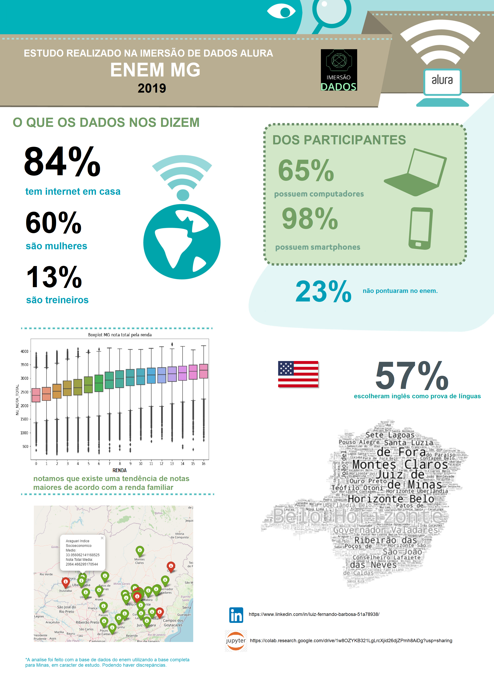

<h1 align="center">
    
</h1>

  <a href="#-tecnologias">Tecnologias</a>
  <a href="#-projeto">Projeto</a>
  <a href="#-resultado">Resultado</a> 

 

# 🚀 Tecnologias

Esse projeto foi desenvolvido com as seguintes tecnologias:

- [Colab](https://colab.research.google.com/)
- [Python](https://www.python.org/)
- [Jupyter](https://jupyter.org/)
- [Sqlite](https://www.sqlite.org/)

# 💻 Projeto

Fizemos nossa análise em dados da Educação, para isto utilizamos a base de dados do ENEM 2019. 
A base utilizada já é uma amostra selecionada. Assim você não precisa trabalhar com 3 gigas de dados!
Para enteder o que cada coluna representa, uitlizamos um dicionário de dados.

# 🔖 Resultado

  

---

Feito com 💛️ por Luiz Fernando 
